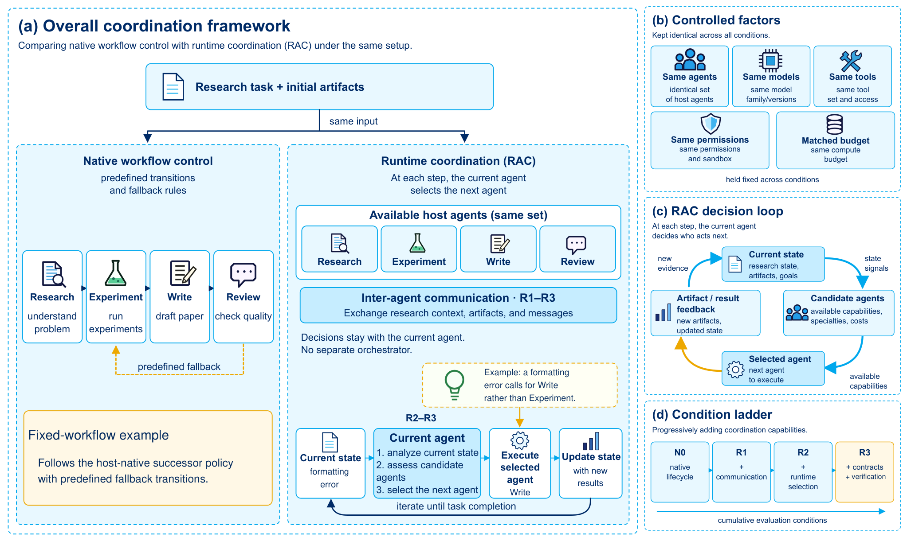
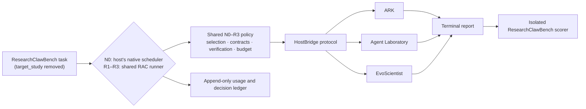

<h1 align="center">
  <a href="https://arxiv.org/abs/2610.00980">
    </a><br>
  <b>Runtime AI Scientist</b><br>
  <b>Can AI Scientists Coordinate at Runtime? 🧑‍🔬</b><br>
</h1>

<p align="center">
  📄 <a href="https://arxiv.org/abs/2610.00980">[Paper]</a> |
  📖 <a href="docs/runbook.md">[Runbook]</a> |
  🧪 <a href="#run-more-experiments-with-us">[Run Experiments With Us]</a> |
  📝 <a href="#citing-runtime-ai-scientist">[Cite]</a>
</p>

<p align="center">
  <a href="https://arxiv.org/abs/2610.00980"></a>
  <a href="https://github.com/systemind-team/Runtime-AI-Scientist/actions/workflows/offline.yml"></a>
  <a href="LICENSE"></a>
  
</p>

Multi-agent AI scientists such as [Agent Laboratory](https://github.com/SamuelSchmidgall/AgentLaboratory), [EvoScientist](https://github.com/EvoScientist/EvoScientist), and [ARK](https://github.com/kaust-ark/ARK) can already take a research question from literature review to a written report. Most of them coordinate at *design time*: a fixed workflow decides which agent acts next. Human scientists work differently. They change who does what as results come in.

**Runtime AI Scientist** is the official code for our paper **[Can AI Scientists Coordinate at Runtime?](https://arxiv.org/abs/2610.00980)** It introduces **Runtime Agent Coordination (RAC)**. At every handoff, the current agent selects the next authorized agent of an existing AI-scientist host from the live state of the research: current artifacts, open problems, execution history, and remaining budget. RAC can also give the selected agent a scoped work contract and pass artifact-grounded verification to whoever acts next. It does not replace a host's agents, models, tools, or permissions.

This repository is the integration and evaluation layer behind the paper: one shared N0–R3 policy, runner, schema set, and budget ledger, applied unchanged to three AI-scientist hosts and evaluated on [ResearchClawBench](https://github.com/InternScience/ResearchClawBench). The project was developed as **RAC × AI Scientist**; the Python package and CLI keep the name `rac-ai-scientist`.

### News

- **2026-10-01** — The paper is on arXiv: [Can AI Scientists Coordinate at Runtime?](https://arxiv.org/abs/2610.00980)
- **2026-09-30** — `v0.1.0-alpha`: the public N0–R3 integration for ARK, Agent Laboratory, and EvoScientist.

### Results at a glance

Mean ResearchClawBench score per host and condition (Table 3 of the paper). Tasks are equally weighted and recorded zeros are retained.

| Condition | ARK | Agent Laboratory | EvoScientist |
|---|---:|---:|---:|
| N0: Native lifecycle | 16.66 | 5.47 | 15.99 |
| R1: Runtime communication | 17.40 | 9.63 | 12.07 |
| **R2: + Runtime selection** | **18.42** | **12.08** | **18.53** |
| R3: + Contracts and verification | 17.98 | 9.88 | 15.96 |

Runtime selection (R2) has the highest observed mean for every host. Adding contracts and verification (R3) lowers these means, and R3 against native execution depends on the host. R2's estimated cost per task was below N0's for ARK and Agent Laboratory and about three times N0's for EvoScientist. This is a **single-seed exploratory evaluation** on 10 ResearchClawBench tasks (5 for ARK) under host-calibrated budgets; task-level scores, token usage, estimated cost, and a DiscoveryBench transfer study are in the paper. More seeds, tasks, and models are the most useful next experiments, and you can [help run them](#run-more-experiments-with-us).

> [!CAUTION]
> Live episodes run LLM agents that write and execute code inside the host containers. Run them in Docker on a machine you can isolate, keep credentials out of task bundles, and set a lifecycle budget for every episode. The offline checks below make no model calls.

## Table of Contents

1. [Introduction](#introduction)
   - [The N0–R3 condition ladder](#the-n0r3-condition-ladder)
   - [How it fits together](#how-it-fits-together)
2. [Requirements](#requirements)
   - [Installation](#installation)
   - [Supported Models and API Keys](#supported-models-and-api-keys)
3. [Setting Up the Hosts and the Benchmark](#setting-up-the-hosts-and-the-benchmark)
4. [Run Runtime AI Scientist Experiments](#run-runtime-ai-scientist-experiments)
5. [Scoring an Episode](#scoring-an-episode)
6. [Run More Experiments With Us](#run-more-experiments-with-us)
   - [Open experiments](#open-experiments)
   - [How to contribute an experiment](#how-to-contribute-an-experiment)
   - [Community results](#community-results)
   - [Adding a new AI-scientist host](#adding-a-new-ai-scientist-host)
7. [Repository Layout](#repository-layout)
8. [Integrity Rules](#integrity-rules)
9. [Upstream Projects and Credits](#upstream-projects-and-credits)
10. [Citing Runtime AI Scientist](#citing-runtime-ai-scientist)
11. [Frequently Asked Questions](#frequently-asked-questions)
12. [Project Policies and License](#project-policies-and-license)

## Introduction

### The N0–R3 condition ladder

Every experiment compares the same host under four cumulative conditions:

| ID | Configuration | What the condition adds |
|---|---|---|
| **N0** | Native lifecycle | The host's own scheduler runs end to end: no RAC phase loop and no extra communication. |
| **R1** | Runtime communication | Agents exchange requests, results, and artifacts through a fresh [SharedNet](https://www.sharednet.ai) Room; every handoff still goes to the host's native successor. |
| **R2** | + Runtime selection | The current agent selects the next host capability from a fresh checkpoint under the shared policy. There is no separate orchestrator. |
| **R3** | + Contracts and verification | Each invocation gets a scoped work contract. An artifact-grounded `supported`, `refuted`, or `inconclusive` verdict is recorded and passed to the next selected agent. |

Within a host/task/seed comparison, the model, tools, permissions, input artifacts, and lifecycle budget are identical, and router and verifier usage is charged to the same budget. R3 verification is advisory: a verdict never stops, retries, or rolls back a step, and the agent's persisted work is kept.

N0 bypasses the RAC runner entirely. The integration layer invokes the host-owned top-level lifecycle once (ARK `Orchestrator.run()`, Agent Laboratory `LaboratoryWorkflow.perform_research()`, or one complete EvoScientist Deep Agent job) and records only the run boundary, artifacts, usage, and terminal state. ARK keeps its native caps of three development and three paper-review iterations.

### How it fits together



Host bridges translate; they do not decide. A bridge maps native roles, stages, and files to capability cards and typed artifacts, invokes the requested native capability under a supplied contract, and reports usage and errors. Ranking capabilities, choosing retries, setting acceptance thresholds, and deciding when an episode stops all live in the shared package, so every host is compared under the same rules. The three hosts run in separate images because their dependency stacks conflict. See [docs/architecture.md](docs/architecture.md) for the full boundary.

## Requirements

- **Offline development and tests:** Python 3.10 or newer. No model calls, credentials, or upstream checkouts are needed.
- **Live experiments:** a Linux host with Docker Compose, network access to your model provider, and disk space for one image per host. Agent Laboratory brings a large pinned ML stack.
- **Models:** an OpenAI-compatible endpoint for the evaluated model, and a separate judge model for scoring.

### Installation

```bash
git clone https://github.com/systemind-team/Runtime-AI-Scientist.git
cd Runtime-AI-Scientist
python -m venv .venv
. .venv/bin/activate              # PowerShell: .venv\Scripts\Activate.ps1
python -m pip install -e .

# Offline checks: no model calls
python -m unittest discover -s tests -v
python scripts/check_secrets.py
rac-ai-scientist --help
```

The CLI has eight subcommands: `doctor`, `plan`, `prepare-task`, `check-workspace`, `verify-upstreams`, `doctor-host`, `run-one`, and `score-episode`. Every command except `run-one` and `score-episode` runs without calling a model.

### Supported Models and API Keys

Copy `.env.example` to `.env` and fill in the values. Never commit this file; Compose reads it automatically.

#### Evaluated model (all hosts)

The three hosts reach the evaluated model through their own clients and share one OpenAI-compatible configuration:

```dotenv
AGENT_API_BASE=<provider endpoint root>
AGENT_API_KEY=<private evaluated-model key>
AGENT_MODEL_NAME=<provider/model identifier>
```

#### Judge model (scoring only)

`JUDGE_PROVIDER=azure` installs the built-in Azure OpenAI adapter, which scores serially and turns provider failures into missing scores rather than zeros. With any other value, ResearchClawBench's own judge client is used.

```dotenv
JUDGE_PROVIDER=azure
JUDGE_API_BASE=<judge endpoint root>
JUDGE_API_KEY=<private judge key>
JUDGE_MODEL_NAME=<judge deployment name>
JUDGE_API_VERSION=2025-04-01-preview
JUDGE_MAX_WORKERS=1
```

#### SharedNet (R1–R3 only)

R1–R3 use a [SharedNet](https://www.sharednet.ai) Room as the communication plane. Create a **fresh Room for every episode** and store it in the prepared task's `.env`, not the repository `.env`. Only the non-secret Room ID is written to episode provenance; N0 never reads SharedNet configuration.

```dotenv
SHAREDNET_ROOM_ID=rom_example
SHAREDNET_INVITE='ROOM=rom_example TOKEN=rit_REDACTED BASE=https://www.sharednet.ai'
SHAREDNET_BASE_URL=https://www.sharednet.ai
```

## Setting Up the Hosts and the Benchmark

Upstream projects are not vendored. [`upstream.lock.json`](upstream.lock.json) pins each host and the benchmark to an exact revision and source-tree hash, and the bootstrap script places fresh checkouts under the ignored `upstreams/` directory:

```bash
python3 scripts/bootstrap.py \
  --only ark --only agent_laboratory --only evo_scientist --only researchclawbench

rac-ai-scientist verify-upstreams \
  --only ark --only agent_laboratory --only evo_scientist --only researchclawbench

# Validate the example experiment matrix without calling a model
rac-ai-scientist doctor --config configs/experiment.example.json
```

Source pins do not freeze container base images, resolved dependencies, or downloaded resources, so keep environment records for formal comparisons (see the [research reporting checklist](docs/research-reporting.md)). `--allow-floating` exists only as a non-reproducible development escape hatch.

Each host has its own Compose service and build context:

| Host | Compose service | `--host` | Build-context variable |
|---|---|---|---|
| ARK | `ark` | `ark` | `ARK_CONTEXT` |
| Agent Laboratory | `agent-laboratory` | `agent_laboratory` | `AGENT_LABORATORY_CONTEXT` |
| EvoScientist | `evo-scientist` | `evo_scientist` | `EVO_SCIENTIST_CONTEXT` |

Build an image and run the two zero-model-call preflights before any live episode:

```bash
docker compose build agent-laboratory
docker compose run --rm agent-laboratory doctor-host --host agent_laboratory </dev/null
docker compose run --rm agent-laboratory check-workspace /input/task </dev/null
```

## Run Runtime AI Scientist Experiments

The example below runs one Agent Laboratory episode on ResearchClawBench task `Math_000` under R3 with seed 0. Change `SERVICE`, `HOST`, and the matching build-context variable together to switch hosts, and use exactly the same budget for every condition you compare. The [runbook](docs/runbook.md) ([中文](docs/runbook.zh-CN.md)) covers every step in detail, including tmux sessions and archiving.

```bash
export REPO="$(pwd)" TASK=Math_000 CONDITION=R3 SEED=0     # CONDITION: N0, R1, R2, or R3
export SERVICE=agent-laboratory HOST=agent_laboratory
export AGENT_LABORATORY_CONTEXT=./upstreams/agent_laboratory RCB_CONTEXT=./upstreams/researchclawbench

# Lifecycle budget: an example, not a universal benchmark budget
export MAX_COST_USD=25 MAX_INPUT_TOKENS=60000000 MAX_OUTPUT_TOKENS=1300000
export MAX_AGENT_CALLS=900 MAX_WALL_SECONDS=21600 MAX_HOPS=14

export STAMP="$(date -u +%Y%m%dT%H%M%SZ)"
export PREPARED="$REPO/prepared_tasks/${TASK}_${HOST}_${CONDITION}_${SEED}_${STAMP}" PREPARED_TASK="$PREPARED"
export EPISODE="${HOST}-${TASK,,}-${CONDITION,,}-s${SEED}-${STAMP}"
export CELL_RUN_ROOT="$REPO/runs/cells/$EPISODE" && mkdir -p "$CELL_RUN_ROOT"

# 1. Build a target-free task bundle; the host never sees target_study
rac-ai-scientist prepare-task --task-dir "$REPO/upstreams/researchclawbench/tasks/$TASK" --output "$PREPARED"
rac-ai-scientist check-workspace "$PREPARED"
# For R1-R3, put a fresh SharedNet Room in "$PREPARED/.env" (see above)

# 2. Run the episode (omit --sharednet-env-file for N0)
export RAC_IMAGE_ID="$(docker compose images -q "$SERVICE")"
docker compose run --rm "$SERVICE" run-one \
  --host "$HOST" --condition "$CONDITION" --task-dir /input/task \
  --sharednet-env-file /input/task/.env \
  --run-root /runs --episode-id "$EPISODE" --seed "$SEED" \
  --max-cost-usd "$MAX_COST_USD" --max-input-tokens "$MAX_INPUT_TOKENS" \
  --max-output-tokens "$MAX_OUTPUT_TOKENS" --max-agent-calls "$MAX_AGENT_CALLS" \
  --max-wall-seconds "$MAX_WALL_SECONDS" --max-hops "$MAX_HOPS" \
  2>&1 | tee "$REPO/${EPISODE}.run.log"
```

`run-one` refuses to overwrite an existing episode, so every retry gets a new episode ID and failed attempts stay on disk for audit. Some hosts buffer their output; check `docker ps` and `episode.json` before concluding that a quiet run has failed.

To plan a full experiment, copy `configs/experiment.example.json` to `configs/experiment.json` and fill in hosts, conditions, tasks, seeds, model, judge, and budget. `doctor` validates it and `plan` expands the Cartesian product into JSONL with stable episode IDs and a config hash, so a scheduler can resume without duplicating cells:

```bash
rac-ai-scientist doctor --config configs/experiment.json
rac-ai-scientist plan --config configs/experiment.json
```

## Scoring an Episode

Scoring runs in a separate `scorer` image, because only the scorer may read `target_study`. Score every episode that produced `episode.json`, including failed and budget-exhausted ones:

```bash
docker compose build scorer
export SCORER_IMAGE_ID="$(docker compose images -q scorer)"
docker compose run --rm scorer score-episode --episode-dir "/runs/$EPISODE" --benchmark /opt/benchmark
```

Each invocation appends an immutable record under `scores/`, and `score.json` points to the latest selected attempt. Provider failures, parse failures, and missing reports produce `total_score: null` with an explanation, so a missing score is never confused with a valid zero. Archive `episode.json`, `score.json`, `scores/`, `coordination.jsonl`, logs, reports, code, and outputs, excluding generated `.conda_env/` directories, as described in the [runbook](docs/runbook.md).

## Run More Experiments With Us

The paper is a single-seed exploratory study, so there is plenty left to test. Everything below can be run with this repository as it is. If you want to take one on, **open an issue first**. That way we can agree on the comparison before anyone looks at outcomes and avoid two groups paying for the same cells.

### Open experiments

- **More seeds.** Repeat N0 and R2 (ideally R1 and R3 too) on the paper's tasks with seeds 1–4. Does R2's lead survive paired per-task comparisons?
- **More tasks and domains.** ResearchClawBench covers many more tasks than the paper ran. Is there a domain where runtime selection loses to the native workflow?
- **Other evaluated models.** Swap `AGENT_MODEL_NAME` and keep everything else fixed. Is the effect model-dependent?
- **Why R3 costs score.** Compare R2 and R3 at larger budgets and analyse the per-hop verdicts. Do contracts and verification pay off once the budget stops binding?
- **Equal spend, not just equal limits.** Compare conditions at matched *consumed* tokens or cost, separating coordination quality from extra compute.
- **Other benchmarks.** The paper includes a DiscoveryBench transfer study; other end-to-end research benchmarks are open.

### How to contribute an experiment

1. **Propose.** Open an [experiment proposal](https://github.com/systemind-team/Runtime-AI-Scientist/issues/new?template=experiment_proposal.yml) naming the hosts, tasks, conditions, seeds, model, and budget. Freeze them, along with the score and the treatment of failed episodes, before running.
2. **Plan.** Write the matrix into `configs/experiment.json`; `doctor` and `plan` give you stable episode IDs and a config hash.
3. **Run and score.** Use a fresh episode directory per cell and a fresh SharedNet Room per R1–R3 episode. Keep failed and budget-exhausted episodes in the denominator.
4. **Report.** File a [reproducibility report](https://github.com/systemind-team/Runtime-AI-Scientist/issues/new/choose) following the [research reporting checklist](docs/research-reporting.md), with source revisions, configuration, usage, scores, and redacted archives or a link to them. Never include keys, SharedNet invites, or benchmark answers.
5. **Get listed.** Reports that carry the checklist's evidence are added to the table below with credit.

### Community results

| Study | Hosts | Conditions | Tasks × seeds | Evidence |
|---|---|---|---|---|
| Paper (Liu et al., 2026) | ARK, Agent Laboratory, EvoScientist | N0–R3 | 10 ResearchClawBench tasks (5 for ARK) × seed 0 | [arXiv:2610.00980](https://arxiv.org/abs/2610.00980) |
| *Your study* | | | | [Propose an experiment](https://github.com/systemind-team/Runtime-AI-Scientist/issues/new?template=experiment_proposal.yml) |

### Adding a new AI-scientist host

If there is a multi-agent AI scientist you would like to coordinate at runtime, you can add it as a host, much as you would add a template to [The AI Scientist](https://github.com/SakanaAI/AI-Scientist). A host is any existing system whose roles can be exposed as resumable capabilities:

1. **Pin the upstream** in `upstream.lock.json` (URL, revision, source-tree hash, license) so `scripts/bootstrap.py` can fetch it.
2. **Declare its capabilities** in `configs/hosts/<host>.json`: for each capability, list its readable and writable artifacts, what it produces, and its native successors. See [`configs/hosts/agent_laboratory.json`](configs/hosts/agent_laboratory.json).
3. **Implement a `HostBridge`** in `src/rac_ai_scientist/hosts/<host>.py`: `initialize`, `checkpoint`, `native_next`, and `invoke` for R1–R3, plus `run_native` for an N0 lifecycle. Then register it in [`hosts/registry.py`](src/rac_ai_scientist/hosts/registry.py).
4. **Give it its own image** (`docker/Dockerfile.<host>`) and Compose service; host dependency stacks never share a process.
5. **Add offline tests** (`tests/test_<host>_*.py`) and run the full suite.

Keep policy out of the bridge: it may translate, invoke, and report, but it must not rank capabilities, choose retries, or decide when to stop. Please discuss a new host in an issue before investing in a large implementation; [CONTRIBUTING.md](CONTRIBUTING.md) explains the review expectations. Systems we would especially like to see include [The AI Scientist-v2](https://github.com/SakanaAI/AI-Scientist-v2) and other open multi-agent research systems.

Bug fixes, documentation, and offline tests are just as welcome; see [CONTRIBUTING.md](CONTRIBUTING.md) for the development workflow and where each kind of change lives.

## Repository Layout

```text
configs/                  experiment matrix and host capability declarations
src/rac_ai_scientist/     shared N0–R3 policy, schemas, runner, ledger, and host bridges
  hosts/                  ARK, Agent Laboratory, and EvoScientist bridges
docker/                   one image per host, plus the isolated scorer
docs/                     architecture, runbooks (EN/中文), research reporting checklist
scripts/                  bootstrap, upstream verification, and secret checks
tests/                    offline contract and invariant tests (no model calls)
upstreams/                ignored, revision-pinned upstream checkouts
runs/                     ignored generated episodes and ledgers
```

## Integrity Rules

- The evaluated host never receives `tasks/<id>/target_study`; only the external ResearchClawBench scorer reads it.
- An agent's completion statement is not evidence. R3 records an external, artifact-grounded verdict, which is advisory and never discards persisted work.
- Failed and budget-exhausted episodes stay in the denominator.
- Every reported episode needs its integration, host, and benchmark revisions, environment records, configuration, task, seed, condition, budget, usage, terminal status, and artifact hashes. Check the produced records and supply missing evidence separately rather than assuming it was captured.
- The R3 verifier checks artifact changes, presence, size, non-empty outputs, and invocation status. It does not validate scientific claims, citations, or statistics.

## Upstream Projects and Credits

Runtime AI Scientist coordinates independent open-source projects, each under its own license (see [NOTICE.md](NOTICE.md)):

- **[ARK](https://github.com/kaust-ark/ARK)** (Apache-2.0), run from the [ARK-sharednet](https://github.com/FORLEMON/ARK-sharednet) fork.
- **[Agent Laboratory](https://github.com/SamuelSchmidgall/AgentLaboratory)** (MIT).
- **[EvoScientist](https://github.com/EvoScientist/EvoScientist)** (Apache-2.0).
- **[ResearchClawBench](https://github.com/InternScience/ResearchClawBench)** (MIT), the benchmark and scorer.
- **[SharedNet](https://www.sharednet.ai)**, the runtime communication plane for R1–R3.

We thank the authors of these projects for making their work available. The structure of this README follows [The AI Scientist](https://github.com/SakanaAI/AI-Scientist), whose end-to-end workflow helped define the problem that runtime coordination addresses.

## Citing Runtime AI Scientist

If you use Runtime AI Scientist or RAC in your research, please cite:

```bibtex
@misc{liu2026aiscientistscoordinateruntime,
  title         = {Can AI Scientists Coordinate at Runtime?},
  author        = {Zijian Liu and Yangzhixin Luo and Junyu Lu and Yi Li and Yu Chen and David Xu and William F. Shen and Xinchi Qiu and Xisen Wang},
  year          = {2026},
  eprint        = {2610.00980},
  archivePrefix = {arXiv},
  primaryClass  = {cs.MA},
  url           = {https://arxiv.org/abs/2610.00980}
}
```

GitHub's "Cite this repository" button uses the same metadata from [CITATION.cff](CITATION.cff). When you report results, cite the exact integration commit you ran and credit the hosts and benchmark separately.

## Frequently Asked Questions

We recommend reading [the paper](https://arxiv.org/abs/2610.00980) first.

**What is the difference between Runtime AI Scientist and The AI Scientist?**
[The AI Scientist](https://github.com/SakanaAI/AI-Scientist) is a single end-to-end system that generates research ideas, runs experiments, and writes papers. Runtime AI Scientist is not another AI scientist. It wraps *existing* multi-agent AI scientists and changes only how their agents hand off work, so the same agents, models, tools, and budget can be compared with and without runtime coordination.

**Do I need a GPU?**
The integration layer itself does not. Compute needs come from the hosts and the tasks you select, and `doctor` asks you to freeze CPU-feasible tasks before live runs.

**What does an episode cost?**
In the paper, standardized cost estimates averaged roughly $4 to $97 per task, depending on host and condition (Table 6, using the uniform tariff in Appendix B). Your provider's prices will differ. The lifecycle budget flags (`--max-cost-usd`, token, call, wall-time, and hop limits) bound every episode.

**Can I run without SharedNet?**
Yes for N0, which never touches SharedNet. R1–R3 use a SharedNet Room as their communication plane. If you need help getting one for a contributed experiment, ask in an issue.

**Why can't an R3 verdict stop a bad step?**
By design. Verification informs the next agent without blocking transitions or discarding artifacts, which keeps R3 comparable to R2. The paper discusses what this costs.

**Why are the R4 and R5 conditions rejected?**
They are retired labels. Their contract and verification behavior was simplified into R3, and the CLI rejects the old labels on purpose.

**Why does N0 bypass the RAC runner?**
So that N0 is each host's genuine native lifecycle, not a reimplementation of it. R1–R3 use the capability-level runner.

**Where did `RAC-AI_Scientist` go?**
This repository was previously published as `FORLEMON/RAC-AI_Scientist`. Old links redirect here, and the package keeps the `rac-ai-scientist` name.

## Project Policies and License

- [Contributing](CONTRIBUTING.md) · [Research reporting checklist](docs/research-reporting.md) · [Security](SECURITY.md) · [Code of conduct](CODE_OF_CONDUCT.md)
- [Runbook](docs/runbook.md) · [中文运行手册](docs/runbook.zh-CN.md) · [Architecture](docs/architecture.md) · [Changelog](CHANGELOG.md)
- [Third-party notices](NOTICE.md) · [Citation metadata](CITATION.cff)

Runtime AI Scientist is released under the [MIT License](LICENSE). Upstream hosts and the benchmark keep their own licenses. This is an alpha research integration: reproduce claims from frozen revisions, complete episode records, and score artifacts, not from log snippets alone.
